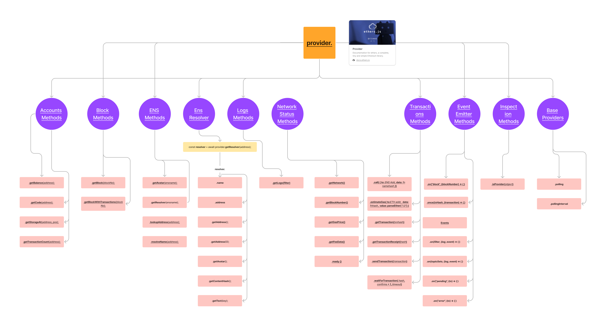
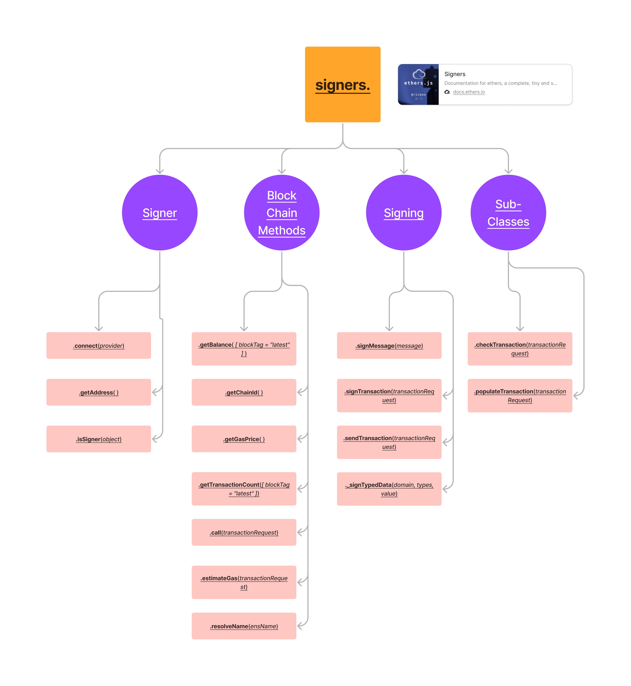

## Etheasy

## Description
A made easy documentation for Ethers.js

## For development 
1. Install all the dependencies   
    `yarn`
2. Start the development server  
    `yarn run dev`
3. Visit [localhost:3000](http://localhost:3000)

## Interactive documentation

